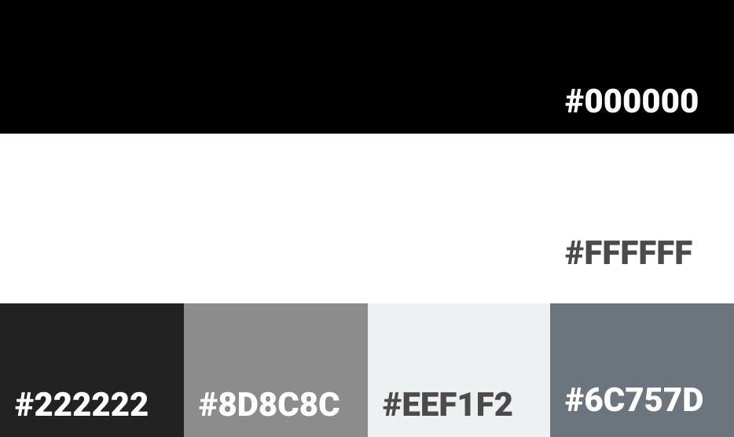

# **Milestone 3: V GAMES**

### **Project - Data Centric Development - Code Institute.**
This is the third milestone project from CI with a focus on HTML, CSS, JavaScript, Python+Flask and MongoDB. The point is to build a full-stack site that allows your users to manage a common dataset about a particular domain. Thus V GAMES is a platform to build community and showcase other developers games, in a simple and effective way. 

A deployed link to the website can be found **[here](https://vgames-app.herokuapp.com/)**.


## **Contents**
***
- [**User Experience (UX)**](<#user-experience-(ux)>)
  - [Project Goals](<#project-goals>)
  - [Importance and Feasibility chart](<#importance-and-feasibility-chart>)
  - [User Stories](<#user-stories>)
  - [Website Structure](<#website-structure>)
  - [Design Choices from UXD](<#design-choices-from-uxd>)
    - [Color Scheme](<#color-scheme>)
    - [Images](<#images>)
    - [Typography](<#typography>)
  - [Wireframes](<#wireframes>)
  - [Design Changes](<#design-changes>)

- [**Features**](<#features>)
  - [Existing Features](<#existing-features>)
  - [Features left to implement](<#features-left-to-implement>)

- [**Database**](<#database>)

- [**Technologies**](<#technologies>)

- [**Testing**](<#testing>)

- [**Deployment**](<#deployment>)

- [**Credits**](<#credits>)

## **User Experience** (UX)
***

### **Project Goals**
The idea is to create an application that showcases the developers' knowledge of HTML, CSS, JavaScript, Python+Flask and MongoDB. Furthermore to showcase an fullstack app with CRUD functionality. The website should be easy to understand, simple to interact with, and give feedback to the user on all inputs.

### **Importance and Feasibility chart**

**Opportunity/Problem** | **Importance** | **Viability/Feasibility**
| :--- | ---: | :---:
A. CRUD Functionality | 5 | 5
B. MongoDB database to store data | 5 | 5
C. Login Functionality | 5 | 5
D. Register Functionality | 5 | 5 
E. Logout Functionality | 5 | 5 
F. Showcase Games | 5 | 5 
G. Ability to search for games | 3 | 4 
H. Responsive design | 5 | 5 
I. Profile | 5 | 5 
J. Contact page, form, response, and sending an email.| 3 | 4 
K. Logo and developers name| 5 | 5 
L. 404 and 500 pages | 3 | 5 
M. Navigation | 5 | 5 

#### [Back to top](<#contents>)

### **User stories**

#### **First Time Visitor Goals**
* As a **user** I want to be able to navigate through the whole site smoothly.
* As a **user** I want to understand the purpose of the site upon loading it.
* As a **user** I want the website to be responsive so that I can clearly view the webpages from my mobile, tablet or desktop.
* As a **user**, I want to be able to register to the website so that I can create and manage my own games.

#### **Returning User Goals**
* As a **user** I want to be able to search or filter games based on custom criteria so that I can find games suited to me.
* As a **user** I want to be able to return to the main site without having to use the browser buttons so that I can easily return to the website if I navigate to a page that does not exist.
* As a **user** I want to have access to uploaded games from other users.
* As a **user** I want to be able to login and out of my account.
* As a **user** I want to be able to upload a game.
* As a **user** I want to have ease of access to any games that I have already uploaded.
* As a **user** I want to be able to edit or delete any games that I have already uploaded.
* As a **user** I want to be able to contact the site owner.

#### **Site Owner Goals**
* As a **site owner** I want to showcase the skills I have learned in HTML, CSS, JavaScript, Python+Flask and MongoDB.
* As a **site owner** I want to be able to showcase other developers games and give them a platform to do so.


#### [Back to top](<#contents>)

### **What is needed now and in the future?**

* The developer wants an aesthetically pleasing and minimalistic website to better showcase the main point: the games. There will be a landing page to grab attention, with information and options to login or register to the site. If the user has registered and logged in, then they will be taken to their profile page. From there they will have access to a home, upload games and contact page. As well as a logout option. 

* The owner could have their needs and more by using a mobile-first approach to a fully responsive website which would allow for easy navigation, use, and no diminished experiences on all viewport sizes.

* Other features further down the line will allow the website to provide a more complete user experience by incorporating a rating/like system to then showcase top rated games. Also, to include a new games section and comment section(with avatar images) where users can give feedback on individual games. And create a admin site to be able to delete, add and update features and data. Thus to liven up the project even more.

#### [Back to top](<#contents>)


### **Website Structure**
This website will focus on mobile-first design, and use seven pages:
* **1**: Landing Page
* **2**: Home Page
* **3**: Profile Page
* **4**: Upload Games Page
* **5**: Edit Games Page
* **6**: Contact Page

Upon loading the page the user will be directed to the landing page (index.html) where they will get options to login or register as well as some general information of the website. Then, when logged in the user will be directed to their profile page(profile.html), where they will see some information on how the platform works. Furthermore can after uploading a game, see their own games displayed as well as a update and delete button icon. From clicking update they will be transferred to a edit form with current info of their game to be changed, as well as a cancel(return back to profile) or update option. If they click on the delete option on their game in profile, a modal will pop up to ask if they are sure if they wish to delete it.  

By clicking on their games they will be transfered to a descriptive game page(game.html), with info about the game, socials, image, and a play button that will take the user to a live weblink of the game. 

From there or in the nav element they can choose to go to home(home.html) to see all games uploaded to the site. Where there also will be a search element that by writing in and searching for will either show up some game results or a not found element. They can also click on the games and be transferred to a game descriptive page(game.html) as mentioned above.

The user can go to contact(contact.html) to send a message to the site owner. The last option in the nav element is the option to logout where the user then will be taken back to the landing page(index.html) and their session will be logged out. 

#### [Back to top](<#contents>)

### **Design Choices from UXD**
***
The style is based on a minimalistic, readable and contrasting design for easy flow and navigation, as well as maintaining consistency to allow the user to easily familiarise themselves with the website efficiently and intuitively.

#### [Back to top](<#contents>)

### **Color Scheme**
The general color scheme is black, grey and white. These colors will create a consistent style for the game. There are also other colors; from the images of the games and hero image. 



### **Images**
The images are consistent of: 
1. Hero image: images from unsplash and made using figma and photopea.
2. Games images which are taken from Unsplash, and some added titles through using figma.
3. Not Found search image, 404 and 500, made through figma. 

### **Typography**
To keep a consistent and modern style, and for easy readability, the font used are Helvetica, and as backups; arial and sans-serif.  

#### [Back to top](<#contents>)

### **Wireframes**
|Sketches|Wireframes|Designs|                         
|:-----:|:----:|:----:|
|[Sketches](readme/wireframes/sketches.jpg)| [Wireframes](readme/wireframes/wireframes.jpg) | [Designs](readme/wireframes/designs.jpg)

### **Design changes**
**Layout:**
* Changed layout on landing page-hero: removed email input. 
* Upload/edit game layout to a more simplified look, from having social icons to none, and added headings and spaces, and a cancel button, and no large image input and terms and conditions checkbox. 
* No Comments section and avatar images.
* No New Games, and Top Rated Games sections.
* Added how it works section to profile page.
* Added search field and buttons to home page.

**Register Modal:**
* No email input and image/avatar input, instead added V Game logo.

**Login Modal:**
* No additional text before username and password. 

**General:**
* Not added Top rated feature and "like" button feature.
* Changed back to top button design.
* Add 404 and 500 pages.
* Added contact page.

#### [Back to top](<#contents>)

## **Features**
***

### **Existing Features**

Included in the **website** is:

* **Navigation:** Displaying home, upload games, profile, contact and logout.
* **Landing page:** Displaying images and information on the sites purpose. 
* **Login/Logout/Register:** Functionality for letting the user register, login and logout.  
* **Home page:** That displays 9 games, as well as pagination and search function.  
* **Profile page:** Showing basic user information and games created by the user with modification ability and some information on how it works.
* **Contact page:** With form and EmailJS functionality to contact site owner.
* **Responsive design:** On tablet, mobile, desktop. Though, with a focus on mobile first responsive design
* **Upload and edit pages:** Pages to let users upload and edit changes to their games.
* **Game page:** Create information pages on each game when clicked on game images, with play button(live link), socials etc.
* **Logo:** A logo telling the name of the website "V GAMES".   
* **Footer:** Social links and copyright info. 
* **404 page:** A message telling the user they have accessed a page that does not exist. 
* **500 page:** A message telling the user that something went wrong. 

### **Features Left to Implement(Possible features)**
* **Comment Section:** To add to the games descriptions for other users to give feedback and comments, as well as give the owner a chance to reply. 
* **Avatar:** So that users can upload their own avatar image, and add that to their username.
* **Like/Rate icon:** So that users can rate/like other users games. 
* **Top Rated Section:** Based on users like/rating a section with top rated games will be shown. 
* **New Games Section:** Based on when games are uploaded it will be showcased in a new games section.
* **Admin:** Admin login will be implemented to allow admin users to delete any games that may be inappropriate.
* **Game Image:** Ability to upload a saved image to their games rather than relying on a URL.
* **Delete Account:** Give users the ability to delete their account, and to get the option to delete their games or leave them.


#### [Back to top](<#contents>)

## **Database**
***

MongoDB Object format examples:

## Games

Collection: games<br>
{<br>
&nbsp; _id: unique-value,<br>
&nbsp; title: "Game title",<br>
&nbsp; photo1: "Img Url",<br>
&nbsp; photo2: "Img Url",<br>
&nbsp; link: "link to live site for Game"<br>
&nbsp; description: "Description of Game"<br>
&nbsp; keywords:"Visual Novel, Story, Graphic"<br>
&nbsp; github:"https://github.com/"<br>
&nbsp; linkedin:"https://www.linkedin.com/"<br>
&nbsp; instagram:"https://www.instagram.com/"<br>
&nbsp; created_by: session[user]<br>
&nbsp; date:"08.11.2021"<br>
}

## Users

Collection: users<br>
{<br>
&nbsp; _id: unique-value,<br>
&nbsp; username: "Admin",<br>
&nbsp; password : "secret password"(hashed password for user security)<br>
}

**Security:**
Database connection details are for security reasons, set up in an [env.py](https://pypi.org/project/env.py/) and not uploaded to GitHub. This is to ensure that the database and connection details are not visible to users. In production these are stored in Heroku.

## **Technologies**
***

### **Languages**
* [HTML5](https://en.wikipedia.org/wiki/HTML5 "HTML5") - provides the content and structure for the website.
* [CSS3](https://en.wikipedia.org/wiki/Cascading_Style_Sheets "CSS3") - provides the styling.
* [JavaScript](https://en.wikipedia.org/wiki/JavaScript) -provides the interactivity and functionality.
* [Python](https://www.python.org/) - provides the back-end logic and the means to run/view the website.

### **Frameworks, Libraries & Programs**
* [Flask](https://flask.palletsprojects.com/en/1.1.x/)
* [Flask-PyMongo](https://pypi.org/project/Flask-PyMongo/)
* [Pip3](https://pip.pypa.io/en/stable/)
* [Flask Paginate](https://pythonhosted.org/Flask-paginate/)
* [Jinja](https://jinja.palletsprojects.com/en/3.0.x/)
* [Werkzeug](https://werkzeug.palletsprojects.com/en/2.0.x/)

* [Bootstrap](https://getbootstrap.com/ "Bootstrap") - used to create the layout of the project.
* [Figma](https://figma.com/ "Figma") - used to create the project's wireframes, designs, and logo.
* [Photopea](https://www.photopea.com/ "Photopea") - used to create the project hero image.
* [Imgbox](https://imgbox.com/ "Imgbox") - used to host game images.
* [Font Awesome](https://fontawesome.com/) - used for icons.
* [FavIcon](https://favicon.io/) -used for compressing logo into favIcons.

* [Gitpod](https://www.gitpod.io/ "Gitpod") - used to develop the website.
* [GitHub](https://github.com/ "GitHub") - used to host the project.
* [Git](https://git-scm.com/) -used for version control.
* [Heroku](https://www.heroku.com/) used to deploy live site
* [MongoDB](https://www.mongodb.com/) used to host database information.
* [RandomKeygen](https://randomkeygen.com/) used to create a strong password.

* [Lighthouse](https://developers.google.com/web/tools/lighthouse) for performance review.
* [TinyJPG](https://tinyjpg.com/) - used to reduce image file sizes.
* [ILoveImages](https://www.iloveimg.com/) - used to reduce image file sizes.
* [Google Chrome Developer Tools](https://developers.google.com/web/tools/chrome-devtools) -used to inspect page elements, test different CSS styles, debug issues and responsiveness.
* [Responsive Design Checker](https://responsivedesignchecker.com/) -used to check responsiveness.
* [Techsini](https://techsini.com/multi-mockup/) -used to create the Mock up image in this README.

## **Testing**
***

Testing results can be found **[here](TESTING.md)**.

HTML Code must pass through the **[W3C HTML Validator](https://validator.w3.org/ "W3C HTML Validator")**.

CSS Code must pass through the **[W3C CSS Validator](https://jigsaw.w3.org/css-validator/ "W3C CSS Validator")**.

JavaScript Code must pass through the **[JSHint Validator](https://jshint.com/ "JSHint Validator")**.

Python Code must pass through the **[PEP8 Validator](http://pep8online.com/ "PEP8 Validator")**.

#### [Back to top](<#contents>)

## **Deployment**
***

### **Project Creation**
Navigate to the **[template](https://github.com/Code-Institute-Org/gitpod-full-template)** and click 'Use this template'. Put in Repository name (VGAMES) and check the Include all branches checkbox. Then navigate to the new **[repository](https://github.com/VTwin90/VGAMES)**.

The following commands were used for version control throughout the project:
+ ```git status``` (checks which files have been modified or added, and ready to be committed)
+ ```git add . ``` or ```git add <filename>``` (add all changed files or specific files within the project directory to be committed)
+ ```git commit -m "[TYPE] Reason"``` (commit changes to the local repository)
+ ```git push``` (push all committed changes to the GitHub repository)


### **Deployment to Heroku**
**Create application:**
1. Navigate to Heroku.com and login.
2. Click on the new button.
3. Select create new app.
4. Enter the app name.
5. Select region closest to you.

The live link for the site is here: **[https://vgames-app.herokuapp.com/](https://vgames-app.herokuapp.com/)**

**Set environment variables:**
1. Create a env.py file
2. Insert this information:

```
import os

os.environ.setdefault("IP", "0.0.0.0")
os.environ.setdefault("PORT", "5000")
os.environ.setdefault("SECRET_KEY", " *unique secret key* ")
os.environ.setdefault("MONGO_URI", " *unique uri from mongo.db * ")
os.environ.setdefault("MONGO_DB", " *database name* ")
```

**Note:** Because this contains sensitive information, this needs to be added to the '.gitignore' file. 	

3. Go to MongoDB and to your app database
4. Click the settings tab and then click the Reveal Config Vars button and add the environment variables:

| Key           | Value               |
| ------------- |:--------------------|
| IP            | 0.0.0.0             |
| PORT          | 5000                |
| SECRET_KEY    |*Secure secret key* (to keep client-side sessions secure)  |
| MONGO_URI     | Go to Clusters, Connect and then connect it to your app by giving it the password and DB name that you set up in the link|
| MONGO_DBNAME  |Connect to your database|
|               |                     |

### **Create a local clone**
1. Open GitHub and navigate to repository **[here](https://github.com/VTwin90/VGAMES)**.
2. Click the Code drop-down menu. 
3. Options: 
* Download the ZIP file, unpack locally and open with IDE.  
* Copy git URL from HTTPS dialogue box. 
4. Open your chosen IDE and open the terminal in a directory. 
5. Use the ```git clone``` command with the copied git URL after.
6. Clone of the project is created locally on your machine.

Once the project has been loaded into an IDE of choice, run the following command in the shell to install all the required packages:
> pip install -r requirements.txt

**Note:** The project will not run locally with database connections unless the user sets up an [env.py](https://pypi.org/project/env.py/) file configuring IP, PORT, 
MONGO_URI, MONGO_DBNAME and SECRET_KEY. Furthermore, the user will need the connection details in order to do this. These details are private and not disclosed in this repository for security purposes.

### **Fork Project**

1. Navigate to the GitHub Repository you want to **[fork](https://github.com/VTwin90/VGAMES)**.
2. On the top right of the page under the header, click the fork button.
3. Creates a duplicate of the full project in your GitHub Repository.

#### [Back to top](<#contents>)

## **Credits**
***

### **Code**
Sending message interactivity from EmailJS and CI Tutorial:
* https://www.emailjs.com/docs/

Back to top button code:
* https://mdbootstrap.com/docs/standard/extended/back-to-top/

Flask Pagination:
* https://pythonhosted.org/Flask-paginate/
* [mozillazg on Github](https://gist.github.com/mozillazg/69fb40067ae6d80386e10e105e6803c9)(https://github.com/
* https://github.com/AmyOShea/MS3-Cocktail-Hour

General:
* https://www.w3schools.com
* https://css-tricks.com
* https://getbootstrap.com/
* https://developer.mozilla.org/
* https://flask.palletsprojects.com/en/2.0.x/
* CI Task Manager App Tutorial

### **Media & Content**
Hero Image and images used to make game covers(all from Unsplash):
* https://unsplash.com/photos/L5kdvKe1uj8
* https://unsplash.com/photos/n6poSm7OUIQ
* https://unsplash.com/photos/b1KIO57VMLI
* https://unsplash.com/photos/ju3eqN0gl6Y
* https://unsplash.com/photos/FVbG_r5H_Cc
* https://unsplash.com/photos/L4-16dmZ-1c
* https://unsplash.com/photos/13sk8LUVwMg
* https://unsplash.com/photos/3l3RwQdHRHg
* https://unsplash.com/photos/nKO_1QyFh9o

Logo, (Un)Perfect Date Game and others images as well as all other content are owned by the site owner.

### **Acknowledgments**

**This project is for educational use only and was created for the Code Institute Module of Interactive Frontend Development.**

**Created by Vanja Torp 2021**

#### [Back to top](<#contents>)