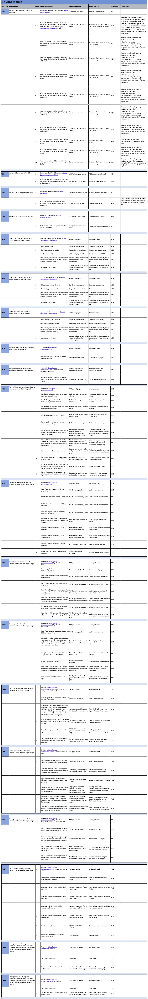
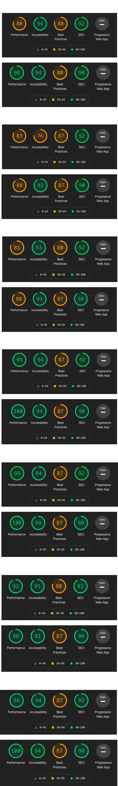

# Test Cases and Execution Report

A full downloadable excel document can be found [here](readme/testing/testResults.xlsx).

Please note these results are a .xlsx file and will require excel, google docs, or a compatible program to open the file.

## **User Story Testing**

### First Time Visitor Goals:
> As a user, I want to be able to navigate through the whole site smoothly.

Tests Covering story:
* TC008
* TC009
* TC010
* TC011
* TC012
* TC013
* TC014
* TC015
* TC016
* TC017

> As a user, I want to understand the purpose of the site upon loading it.

Tests Covering story:
* TC011

> As a user, I want the website to be responsive so that I can view the web pages from my mobile, tablet, or desktop.

Tests Covering story:
* TC005
* TC006
* TC007

> As a user, I want to be able to register to the website so that I can create and manage my games.

Tests Covering story:
* TC010
* TC011

### Returning User Goals:

> As a user, I want to be able to search or filter games based on custom criteria so that I can find games suited to me.

Tests Covering story:
* TC012

> As a user, I want to be able to return to the main site without having to use the browser buttons so that I can easily return to the website if I navigate to a page that does not exist.

Tests Covering story:
* TC018
* TC019

> As a user, I want to have access to uploaded games from other users.

Tests Covering story:
* TC009
* TC012

> As a user, I want to be able to log in and out of my account.

Tests Covering story:
* TC008
* TC009
* TC010
* TC011

> As a user, I want to be able to upload a game.

Tests Covering story:
* TC013
* TC015

> As a user, I want to have ease of access to any games that I have already uploaded.

Tests Covering story:
* TC015

> As a user, I want to be able to edit or delete any games that I have already uploaded.

Tests Covering story:
* TC010
* TC015

> As a user, I want to be able to contact the site owner.

Tests Covering story:
* TC009
* TC010
* TC017

### Site Owner Goals:

> As a site owner, I want to showcase the skills I have learned in HTML, CSS, JavaScript, PythoN+Flask, and MongoDB.

Tests Covering story:
* TC001 - TCO19

> As a site owner, I want to be able to showcase other developers' games and give them a platform to do so.

Tests Covering story:
* TC001 - TCO19

# Issues and Resolutions

## Buttons:

**Issue:**

The buttons were not as rounded as designed in wireframes.

**Resolution:**
* Add rounded-pill class from Bootstrap to buttons.

## Play Button:

**Issue:**

Could not get the button to go to an external link.

**Resolution:**
* Changed button to a a href with styling classes of the buttons.

**Issue:**
 Play buttons were not going to a link when clicked on mobile, because of description padding overflowing it.

**Resolution:**
* Added a play_btn class with z-index 1 and position absolute. 

## Images:

**Issue:**
Images were slowing down loading time. Especially on hero image, and on individual game pages.

**Resolution:**
* Resized images, compressed them, and hero image were made into webp instead of png.

## 404 & 505 Pages:

**Issue:**
Pages what not showing while testing, and got an error, stating the server was either overloaded or there was an application error. 

**Resolution:**
* Was a syntax and url_for routes typo, changed url_for correct routes and it worked. 

# Lighthouse Report Mobile & Desktop

